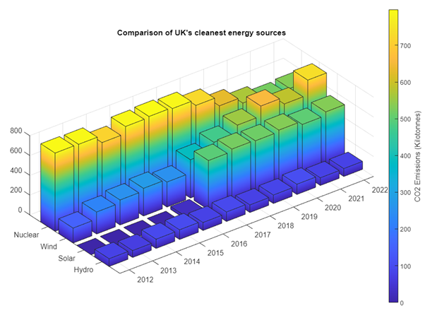

# Data Analysis of UK Energy Grid & CO2 Emissions 

## Introduction taken from my report:
This data was acquired from GridWatch, a SQL database of UK National Grid and interconnector sources. Using the downloaded statistics, useful data will be extracted and studied to see if any patterns emerge that can be commented on. In 2008, the UK government brought into law a requirement to reach net zero emissions by 2050. Hopefully, the data should reflect that commitment.

## Data - Caveats:

Although the creator of GridWatch expresses how the site has gained improvements to its accuracy, there are some statistics that are based on estimations. The following caveats must be considered:
* Renewables are cleaner than fossil fuels however there is no silver bullet, they still have social, economic and CO2 emission impacts.
* Units of electricity generated by renewable sources will not have an equivalent reduction in fossil fuel usage.
* Demand is recorded by central metering. Actual Demand is higher due to embedded technology such as small wind turbines and domestic solar panels. 
* Solar power is NOT included in this data.
* Wind data contains statistics only from metered wind farms. See previous.
* The power used to recharge pumped hydroelectricity is NOT recorded.
* Solar data is an estimated output provided by University of Sheffield. There are reasons to suggest the output is 10% larger.
* OCGT is only used at peak times due to low efficiency compared against its counterpart CCGT.
* Other data represents an unspecific source, possibly STOR capacity such as Diesel.
* Interconnector data is excluded from this report.
* The main software used in this report is MATLAB (see Appendices). Excel has only been used to download and import data.

## Day - Pie Charts
Here you can see the charts that I created for my report that are outputted by running the code in Day/Pie_Charts

## Day - Area Chart 
Below you can see the area chart used to visualise UK Grid Demand in a 24 hour period, run the code in Day/Area_Chart:

## Week - Line Graph with Bar overlay 
Demand with overlayed average energy usage within 7-day week, run the code in Week/ 

## Decade - Tables, Line graphs & 3D Charts
CO2 Emmissions Table and Graphs and 3D chart the table is shown to first be outputted in MATLAB, followed by the finished version in the report. The code can be found in Decade/ 

